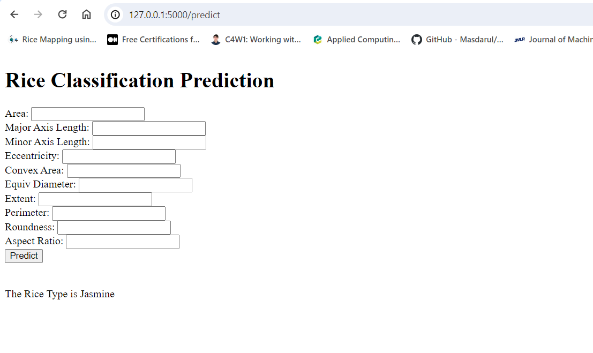
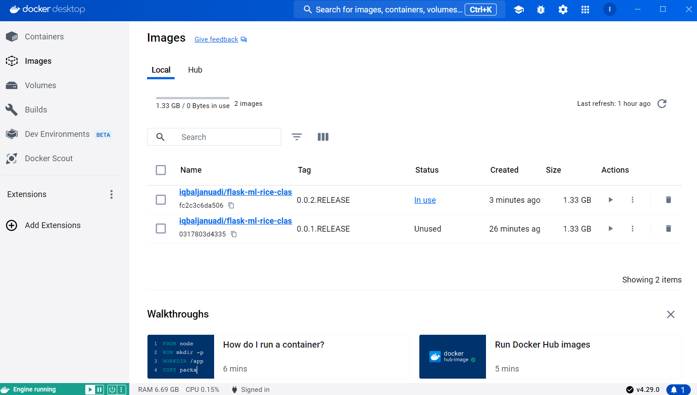
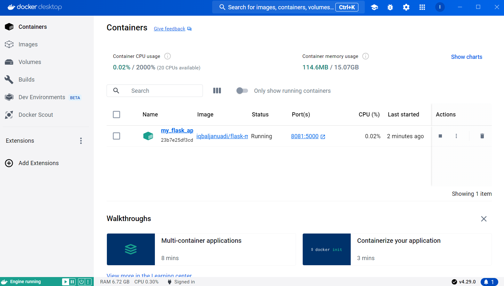
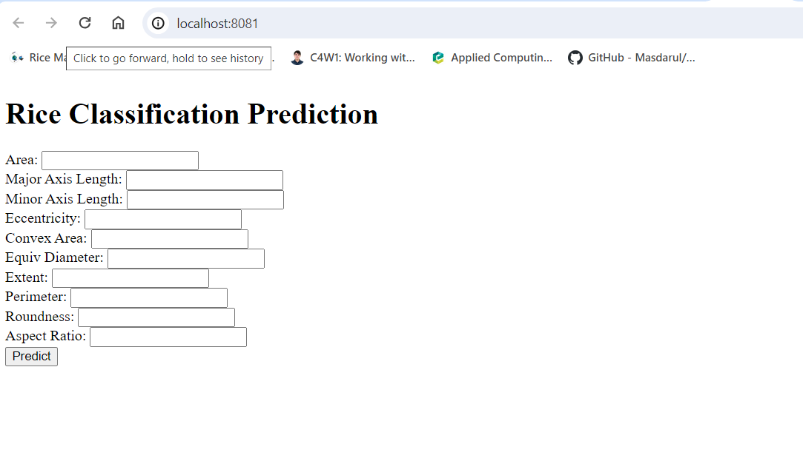

# Rice Classifier ML Apps

**What's Include in this Project**:
1. Supervised Model Development
2. Pipeline for Model Development and GridSearchCV to Find the Best Hyperparameter
3. MLOps using MlFlow (Including Model Registry and Model Serving for Online and Batch Prediction)
4. Create App for Model Deployment using Flask
5. App Deployment using Docker (Docker image, Docker container)

**Introduction**: Rice is a staple food consumed by millions of people worldwide. It comes in various varieties, each with distinct characteristics such as grain size, color, aroma, and cooking properties. Ensuring accurate classification of rice types is essential for quality control, trade, and consumer satisfaction.

**Problem Statement**: Our goal is to develop a robust machine learning model that can accurately classify different types of rice based on their visual features. Given datasets of rice grains, the model should predict the correct rice variety.

**Method**: Building a model pipeline using sklearn, and find the best model hyperparameter using GridSearchCV, MlOps using MlFlow, Deploy model through Flask app, deploy app using Docker.

**Dataset**: This is a set of data created for rice classification from Kaggle (https://www.kaggle.com/datasets/mssmartypants/rice-type-classification). It is modified dataset from this resource: link Jasmine - 1, Gonen - 0. The explanantion of each features in the dataset are listed below:

Here are descriptions for each term:

1. **id**: Identifier or unique identifier for each individual data point or sample.
2. **Area**: The total area or size of the object or particle being measured.
3. **MajorAxisLength**: The length of the major axis of the object, typically the longest dimension.
4. **MinorAxisLength**: The length of the minor axis of the object, typically the shortest dimension.
5. **Eccentricity**: A measure of how elongated or stretched out the shape of the object is, ranging from 0 (perfectly circular) to 1 (highly elongated).
6. **ConvexArea**: The area of the smallest convex polygon that encloses the object.
7. **EquivDiameter**: The diameter of a circle with the same area as the object.
8. **Extent**: The ratio of the area of the object to the area of the bounding box that encloses it, providing a measure of how much the object fills the bounding box.
9. **Perimeter**: The total length of the boundary or perimeter of the object.
10. **Roundness**: A measure of how closely the shape of the object resembles a circle, often calculated as the ratio of the area of the object to the area of a circle with the same perimeter.
11. **AspectRatio**: The ratio of the length of the major axis to the length of the minor axis, providing a measure of the elongation or orientation of the object.
12. **Class**: The category or label assigned to the object, typically used in classification tasks to denote the class or group to which the object belongs. Jasmine - 1, Gonen - 0

-----------------------------------------------------------------------------------------------------------------------------------------------------------------------------------------------

### MLFlow Server (UI). Model Registered Through MLFlow

-----------------------------------------------------------------------------------------------------------------------------------------------------------------------------------------------
### Flask for Model Deployment by creating Simple Flask App. 

-----------------------------------------------------------------------------------------------------------------------------------------------------------------------------------------------
### Docker Image

-----------------------------------------------------------------------------------------------------------------------------------------------------------------------------------------------
### Docker Container

-----------------------------------------------------------------------------------------------------------------------------------------------------------------------------------------------
### Docker Deployed on port:8081

